<!--
  This journal is auto generated by Stasis.
-->

# 10/2/2026 1 PM - Fixing Board Errors

_Time spent: 5h_

So before ordering I went through both boards again and ran DRC and ERC on everything and found a bunch of stuff that would have been bad

the biggest one was on the keybit, one of the pogo header GND pads wasnt connected to anything, the via was there but the track to it never got drawn so that side would have had no ground. Also the SDA3 trace was basically touching the 3.3V pad on one of the pullups (0.02mm lol) so i moved the resistor and rerouted that and yea

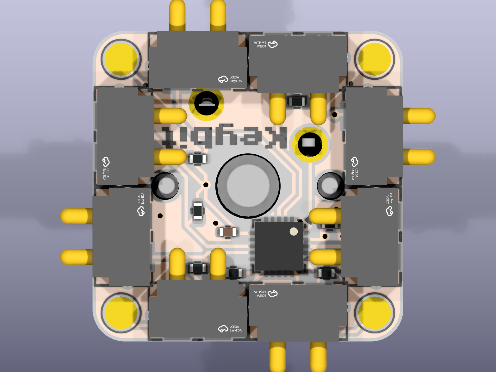

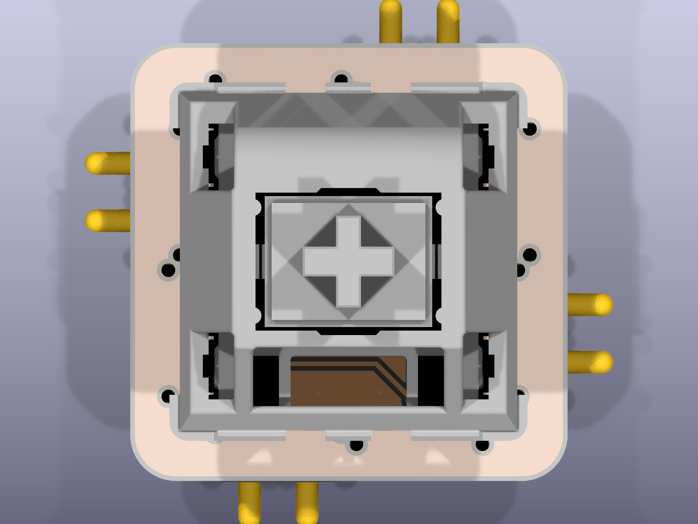

on the keyword a bunch of the resistors all had the same lcsc number which was a 150 ohm resistor with 0 stock so jlc would have put the wrong values on the charger so i cleared those, and the pads that the pogo pins land on were in the bom as pogo pins so I set them to dnp

I also fixed all the library and 3d model paths since they were hardcoded to my windows pc and didnt work on the mac, now they are relative to the project. Then I added the jlcpcb order and shipping to the bom

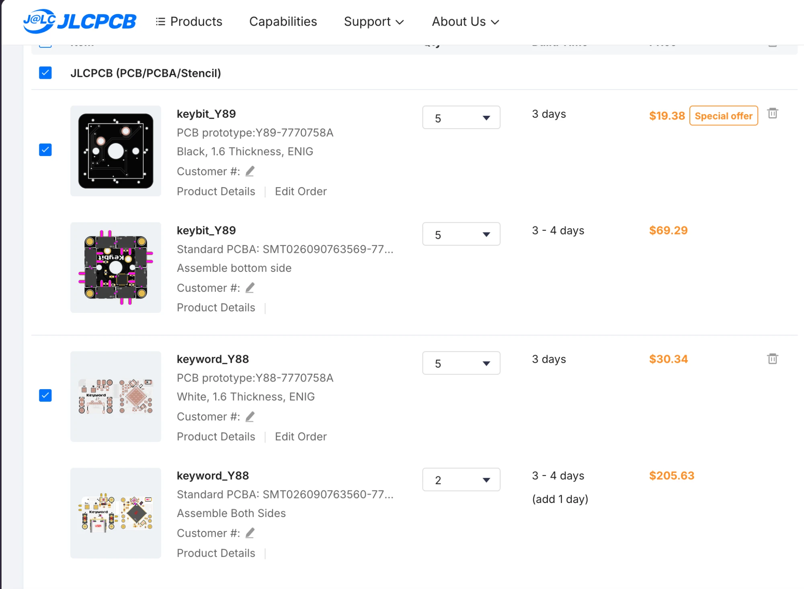

# 6/18/2026 8 PM - Finish CAD

_Time spent: 8h_

So i did a thing with clay and finished the case andx yea, this took a long time as I had a few revisions and yea ts is finished, i will blender render soon as im macondoing and just wanna shoip this so it arrives druring fallout

# 4/10/2026 3 AM - More Cad and finished Keybit Case

_Time spent: 7h_

So after messing around with a few designs in onshape, I got a better Keycap design

there are internal holes for the magnets and the thing latches on to the key switches side latches as shown here

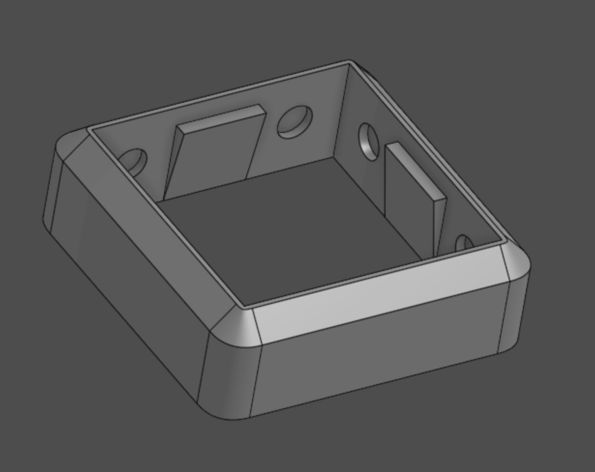

i then printed it out and did a thing and got this

and yea thats basically it, Ill plan on continuing the cad for the main pcb and make it cleaner

# 4/8/2026 12 AM - CAD + Case

_Time spent: 7h_

Idk how to cad but I tried to do it and ended with soemthing like this:

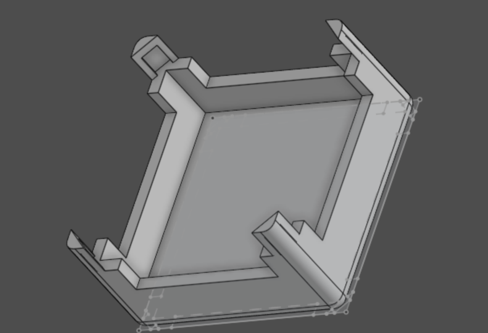

which got printed and it kinda works but the corners are too small and yea

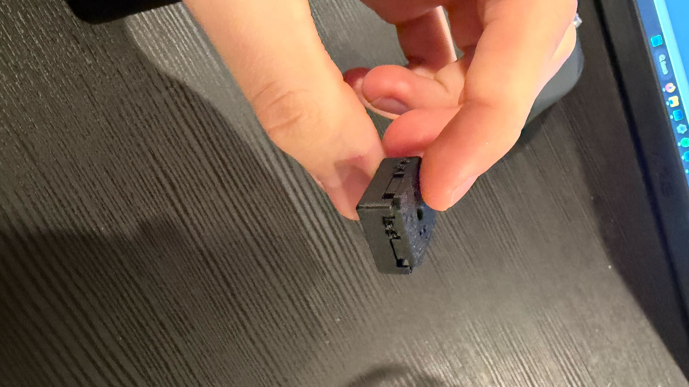

I printed a few out and showed them to clay and he liked them and yea, altho its thin I plan on making the walls thicker and yea, aside from that I think its pretty much done

# 4/6/2026 3 AM - Flash and LED and Touchups

_Time spent: 7h_

So I kinda want to be able to program the CH300v chips from the main board so I needed to add in some pogo pins and then I would also need flash to store the code so I added that in and updated the STM32 MX for that

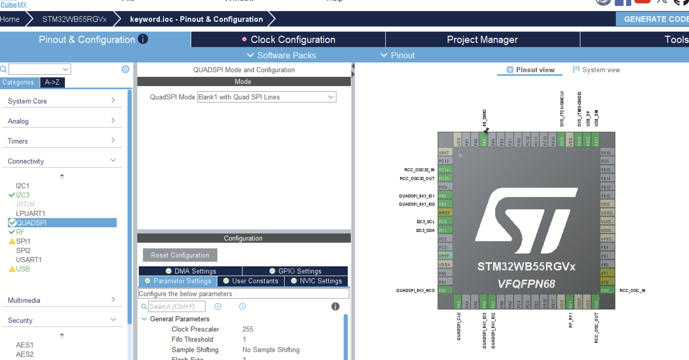

Then after that I finished routing up everything and also replaced the old LED with a RGB one.

Then I updated the schematics to look better and yea

# 4/5/2026 7 PM - Routing

_Time spent: 7h_

So I locked in for a day and finished up the routing for both PCB's. I also had to add in some I2C pullup resistors and had fun with laying them out on both sides and yea

I also did the same for the keybit and ended up with this

it took me a while as I forgot that I had to add in pullup resistors and then had to move things around to add space for them

# 4/5/2026 12 AM - Keyword and Routing

_Time spent: 7h_

So I had a bunch of back and forth between the 2 different STM32 chips, I oringlaly planned on having eherythign on one boar dbut with bluetooht then that would be way complicated so I decided to go on St's website to try and find any stm32s that would support bluetooth and I found a small one bue that meant using a usb to hid converter but the smallest one I could find would take up half the board so I decided to split the boards, and in doing so I rediecided that if I was going to have more area, I might as well have a bigger stm32 chip and just add more stuff to it so I did that and ended up with this:

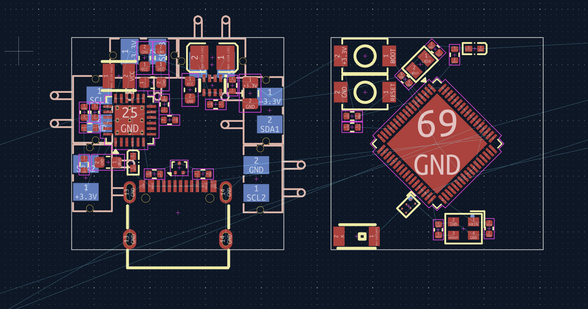

I was still placing the components so I decided to do that some more and got this

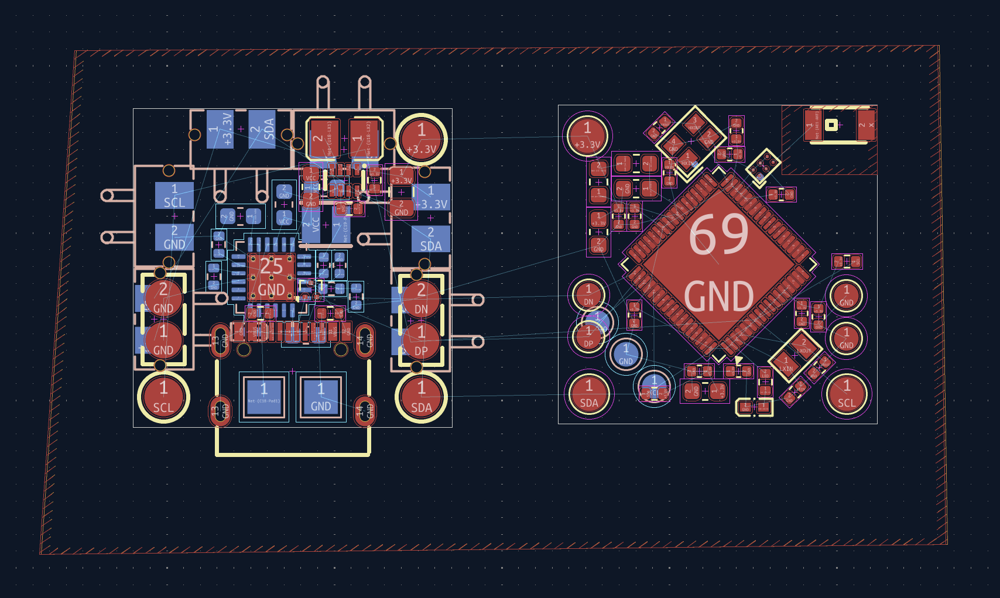

# 3/27/2026 2 AM - Ideation and Schematic

_Time spent: 9h_

So basically Ihad always wanted to make a keyboard but I didnt want to be locked into just one design so I wanna make it so that I can rearrange it at any time.

Yea...

I searched online and couldnt find it anywhere so I decided to make it myself.

I decided on using a cheap risc-v processor and i2c to communicate between the keys and then have a central MCU block that has bluetooth and battery support so yea.

I started on the keybit design (ha ha) and got this:

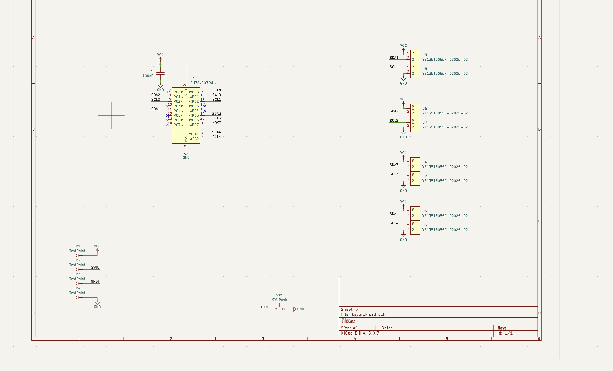

I then also started on the other design for the keyword

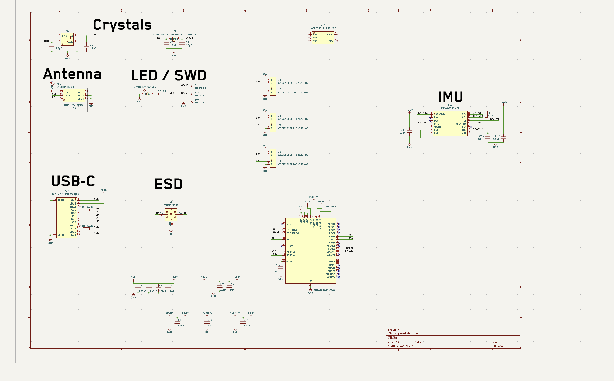

