<h1 align="center">
   
  
   
</h1>

<h4 align="center">
A truly modular keyboard with rearrangeable keys, magnetic keycaps and Bluetooth!
</h4>

  <a href="#key-features">Key Features</a> •
  <a href="#pcb">PCB</a> •
  <a href="#case-and-keycaps">Case &amp; Keycaps</a> •
  <a href="#credits">Credits</a> •
  <a href="#license">License</a>

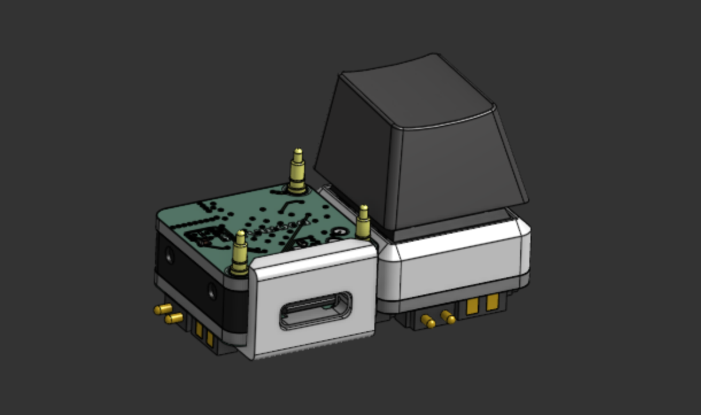

## Key Features

- **Rearrangeable layout** where every key is its own 1u PCB
- **CH32V003** RISC-V microcontroller on every key
- **STM32WB55RGV6** main board with Bluetooth and USB
- **Pogo pins on all 4 sides** of every key for power and I2C
- **Magnetic keycaps** with 2mm x 0.5mm magnets
- **Key programming** from the main board over pogo pins
- **2MB QSPI flash** (W25Q16JV) to store the key firmware
- **Battery charging** with the BQ25895 and solder pads for a 1S LiPo
- **Buck-Boost converter** (TPS631000)
- **RGB status LED**
- **USB-C** with ESD protection
- **Ceramic Bluetooth antenna**

## PCB

Designed in KiCad! There are two boards, the Keybit and the Keyword, and both are 1u (19.05mm x 19.05mm).

### Keybit

A single key with a Cherry MX switch and a CH32V003. Every side has pogo pins for 3.3V, GND and I2C so it can connect to the keyword or to other keybits, and the pads on the corners are for programming.

**Schematic:**

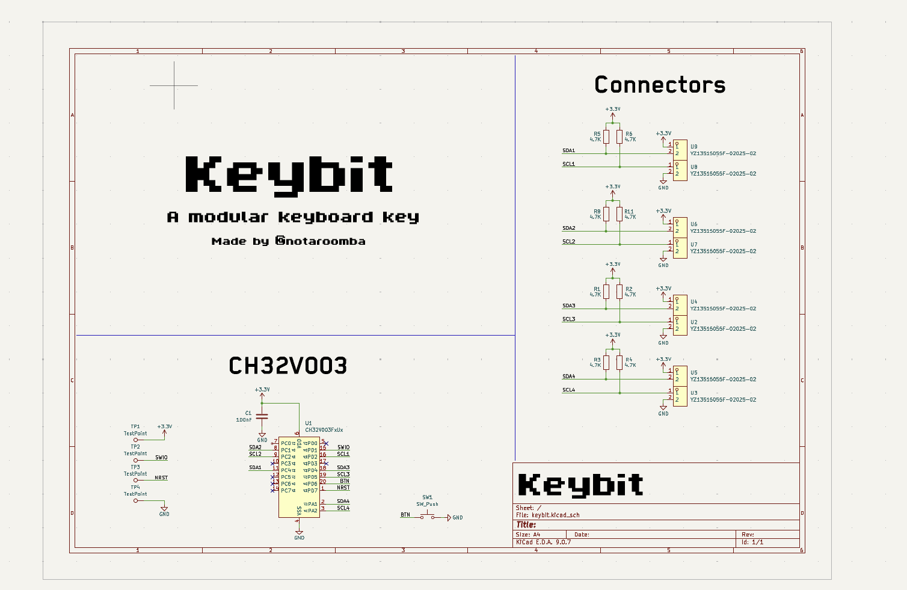

**Layout:**

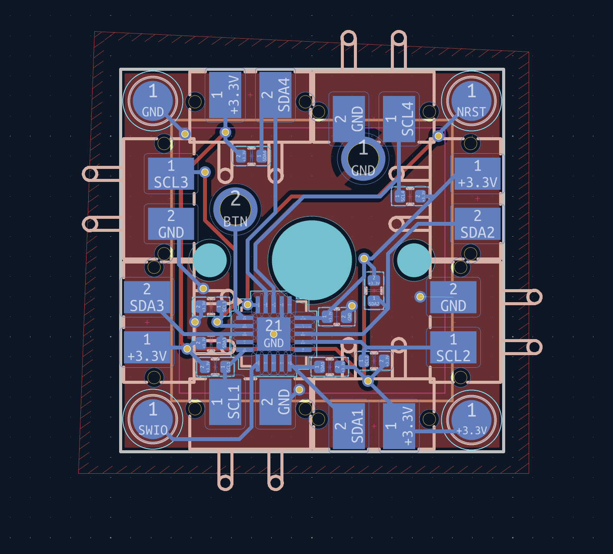

### Keyword

The main board that the keybits connect to. It is split into two PCBs that stack on top of each other. The top one has the STM32WB55RGV6, the antenna and the flash, and the bottom one has the USB-C, the charger and the buck-boost converter. The 3 pogo pins on the top are for programming the keybits.

**Schematic:**

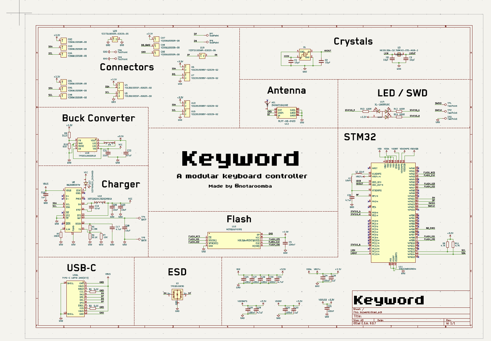

**Layout:**

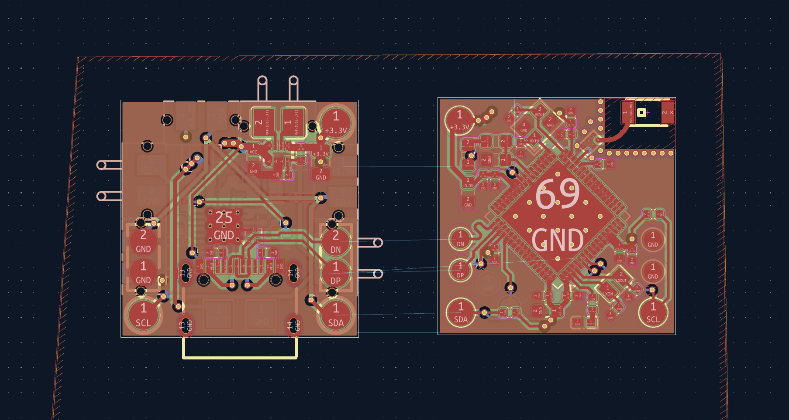

**3D View:**

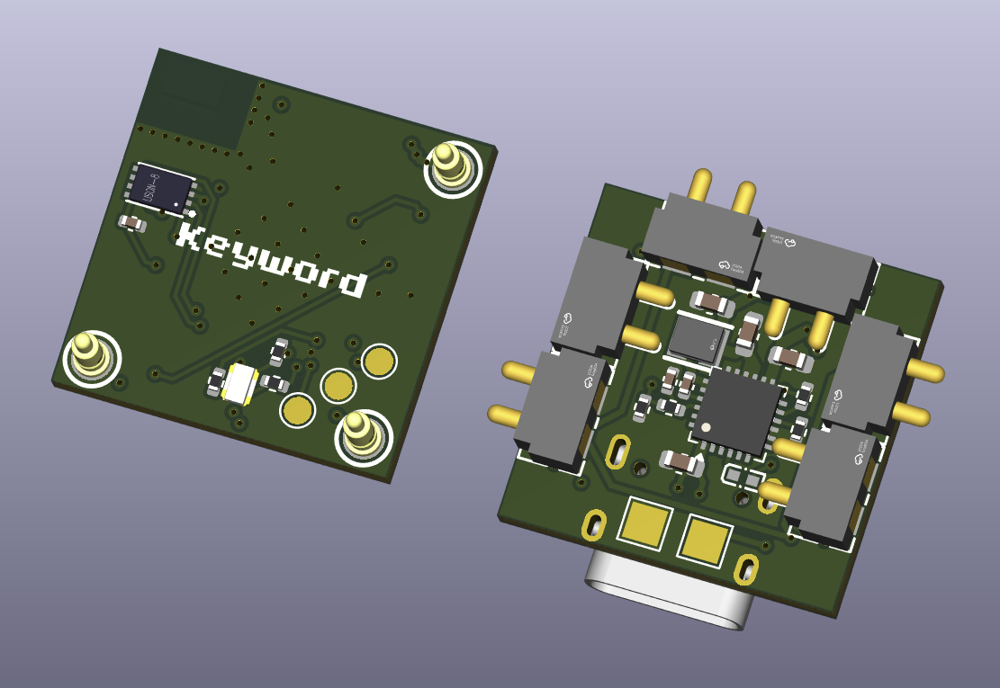
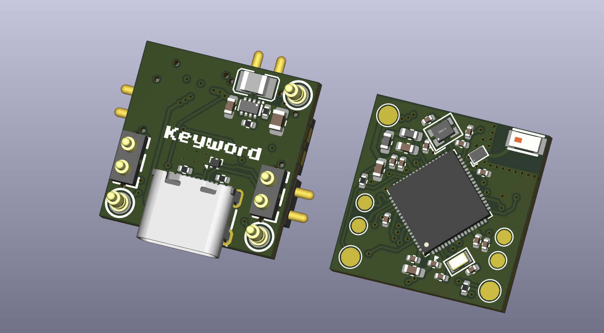

## Case and Keycaps

Custom designed cases and keycaps in OnShape, the STEP files are in the [`cad`](cad) folder.

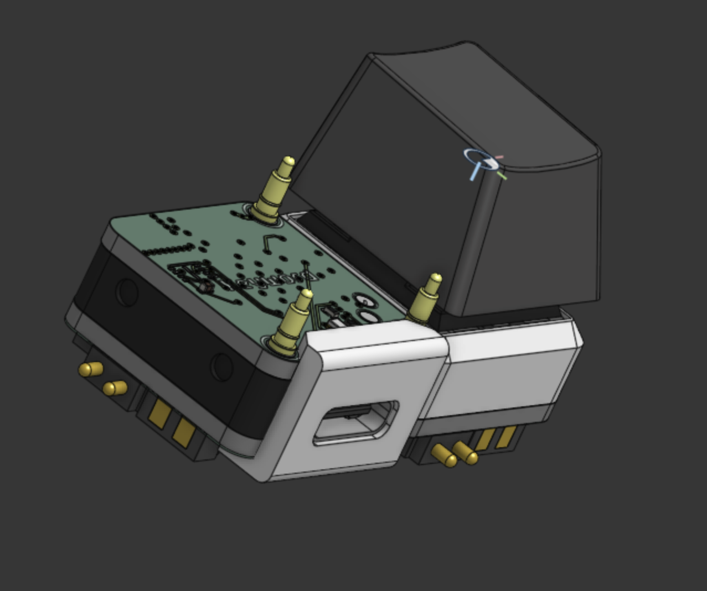

The keycaps have internal holes for the magnets and latch on to the side latches of the key switch.

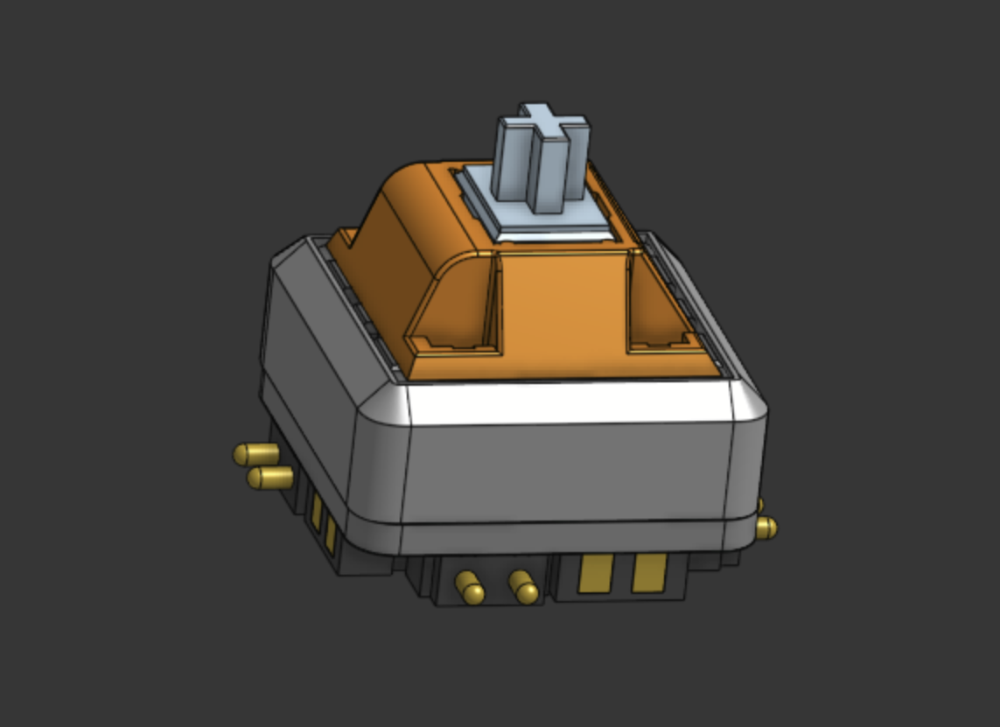
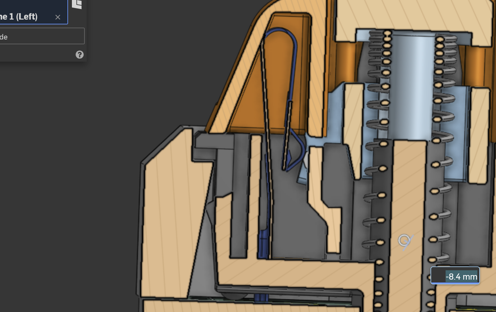
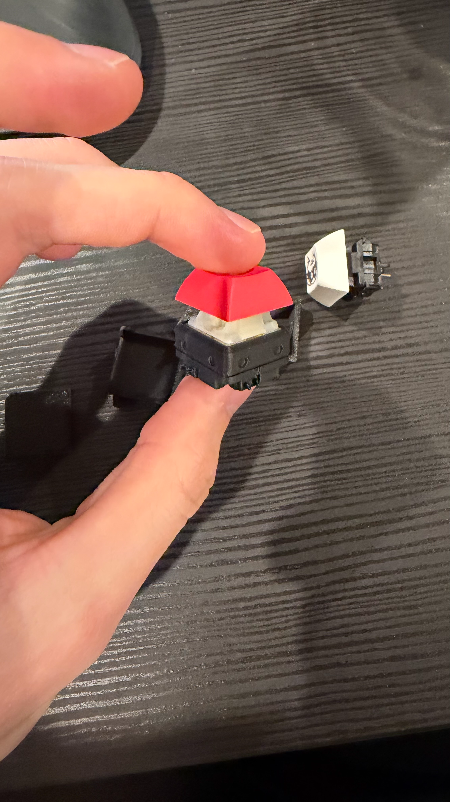

## Credits

This project uses:

- [KiCad](https://www.kicad.org/)
- [OnShape](https://www.onshape.com/) for case design
- [Blender](https://www.blender.org/) for 3D renders
- [STM32CubeMX](https://www.st.com/en/development-tools/stm32cubemx.html)
- [KiCad Fabrication Toolkit](https://github.com/bennymeg/Fabrication-Toolkit) for the JLCPCB files
- [Hack Club Stasis](https://stasis.hackclub.com/)

## You may also like...

- [Ember](https://github.com/NotARoomba/ember) - A USB-C powered reflow hotplate with Bluetooth
- [Cyberboard](https://github.com/NotARoomba/Cyberboard) - A Raspberry Pi Pico-sized STM32 development board with Bluetooth
- [Trace](https://github.com/NotARoomba/Trace) - A comprehensive PCB ruler with reference footprints
- [Linea](https://github.com/NotARoomba/Linea) - An EMR tablet

## License

MIT

---

> [notaroomba.dev](https://notaroomba.dev) &nbsp;&middot;&nbsp;
> GitHub [@NotARoomba](https://github.com/NotARoomba) &nbsp;&middot;&nbsp;
